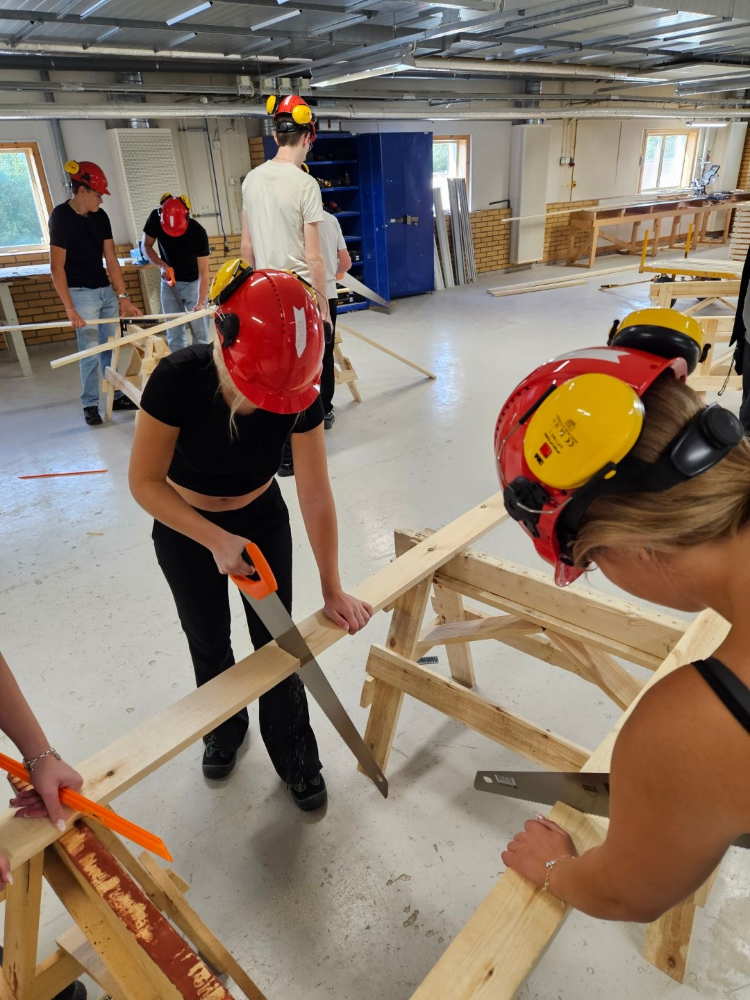
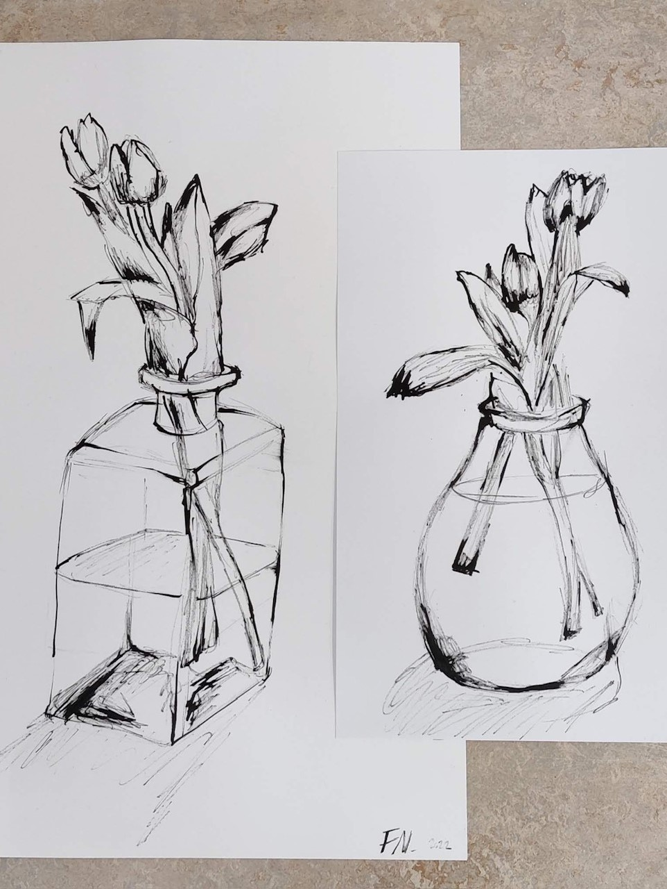

Teknik är ett högskoleförbredande gymnasieprogram som ger behörighet till de flesta högre utbildningarna. Inom teknikprogrammet finns det flera olika inriktningar att välja mellan. Under det första året läser alla teknikelever samma kurser. Under andra året får man chans att välja mellan de två inriktningarna design eller informations- och medieteknik. Mer information om dessa inriktningar hittar du lite längre ner på sidan. Under det tredje året kan respektive inriktning välja på två olika fortsatta studier inom samma inriktning. Det finns även ett gemensamt val som kallas teknikvetenskap. Där läser man kurser som ger behörighet till civilingenjörsutbildningar. För dem som läste Informations- och medieteknik & produktionsteknik i tvåan finns det även möjlighet att välja ett fjärde år och läsa till gymnasieingenjör. För många innebär det fjärde året en garanterad arbetsplats efter gymnasiet.

### Informations- och medieteknik & Produktionsteknik

Många känner nog till att på teknik ingår programmering, men visste du att man också har möjlighet att lära sig om datorers uppbyggnad? På IP-inriktningen lär man sig att programmera med hjälp av olika program, men även hur man bygger ihop en dator (man får mycket hjälp om man aldrig ens sett insidan av en dator förut) och hur nätverk fungerar. Inom mekatronik-kursen som ingår i IP lär man sig om digitalteknik, binära tal och ellära. 

### Design

Visste du att på teknikprogrammet har man möjlighet att lära sig att designa produkter? På design får man lära sig om olika program där man kan designa men även bygga 3D-modeller. Man lär sig olika rittekniker, skapa bilder med olika typer av verktyg, allt från bläck till akvarellfärg. Man övar även på att redigera bilder professionellt i photoshop och InDesign mm.



  

    
  

  

    
  

   

    
  

    

     
  


  

